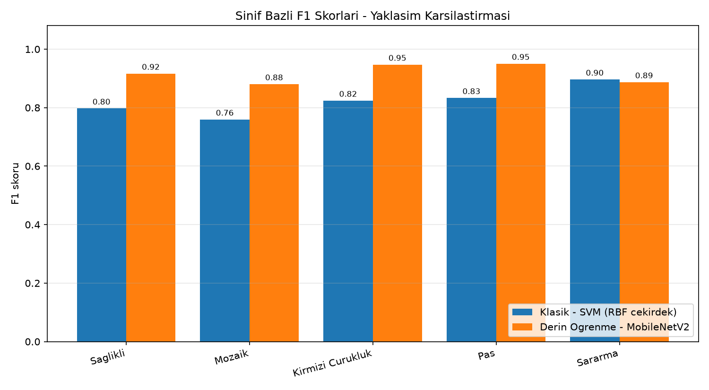
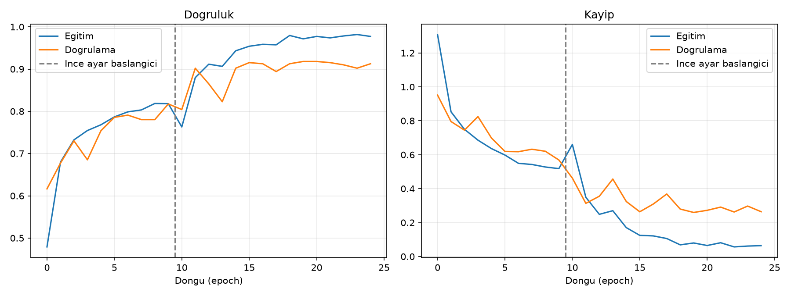

# Şeker Kamışı Yaprak Hastalığı Sınıflandırma

Şeker kamışı yapraklarının fotoğrafından hastalık teşhisi yapan bir görüntü
işleme ve makine öğrenmesi projesi. Aynı veri seti üzerinde **iki farklı
yaklaşım** uygulanıp karşılaştırılıyor: el ile tasarlanmış özniteliklere dayalı
klasik görüntü işleme ve önceden eğitilmiş bir evrişimli sinir ağı ile transfer
öğrenme.

## Veri seti

2.521 etiketli yaprak fotoğrafı, 5 sınıf:

| Sınıf | Türkçe karşılığı | Görüntü sayısı |
|---|---|---|
| Healthy | Sağlıklı | 522 |
| RedRot | Kırmızı çürüklük | 518 |
| Rust | Pas | 514 |
| Yellow | Sararma | 505 |
| Mosaic | Mozaik virüsü | 462 |

Veri, sınıf dağılımı korunarak (stratified) %70 eğitim, %15 doğrulama,
%15 test olacak şekilde bölünüyor. Model seçimi **yalnızca doğrulama
kümesinde** yapılıyor; test kümesi süreç boyunca hiç kullanılmıyor, sadece
nihai raporlama için açılıyor.

## Sonuçlar

Test kümesi (379 görüntü, eğitim sırasında hiç kullanılmadı):

| Yaklaşım | Doğruluk | Makro F1 | Eğitim süresi |
|---|---|---|---|
| Klasik - SVM (RBF çekirdek) | %82,32 | 0,8223 | ~8 saniye |
| Transfer öğrenme - MobileNetV2 | **%91,82** | **0,9165** | ~6,5 dakika (CPU) |

Sınıf bazlı F1 skorları:

| Sınıf | Klasik | MobileNetV2 |
|---|---|---|
| Sağlıklı | 0,798 | **0,917** |
| Mozaik | 0,760 | **0,881** |
| Kırmızı çürüklük | 0,824 | **0,947** |
| Pas | 0,833 | **0,951** |
| Sararma | **0,897** | 0,887 |



### Yorum

Transfer öğrenme klasik yaklaşımı 9,5 puan geride bıraktı, ancak fark sınıfa
göre değişiyor. En büyük kazanç **Mozaik** sınıfında (0,760 → 0,881): mozaik
virüsü renk değil desen bozukluğu olarak göründüğü için el ile tasarlanmış
histogram öznitelikleri bu sınıfta yetersiz kalıyor, evrişimli ağ ise deseni
doğrudan öğreniyor.

**Sararma** ise klasik yaklaşımın önde kaldığı tek sınıf. Beklenen bir sonuç:
sararma neredeyse tamamen renk temelli bir belirti ve HSV histogramları bunu
zaten çok iyi yakalıyor.

Klasik yaklaşımın hâlâ bir değeri var: eğitimi 8 saniye sürüyor, modeli 2 MB,
ve hangi özniteliğin karara katkı verdiği doğrudan incelenebiliyor. Düşük
donanımlı bir sahada çalışacak uygulama için makul bir seçenek.

### Eğitim sürecinde karşılaşılan sorun

İlk denemede derin model yalnızca %78,6 doğruluk verdi — yani klasik yaklaşımın
altında kaldı. Sebep, ince ayar aşamasında gövde çözüldüğünde eğitim
doğruluğunun 0,78'den 0,60'a düşmesiydi. İki düzeltme yapıldı:

1. **BatchNormalization katmanları donuk bırakıldı.** Çözüldüklerinde küçük
   yığınlarla hesaplanan yeni ortalama/varyans değerleri, önceden öğrenilmiş
   istatistikleri bozuyordu.
2. **İnce ayar öğrenme oranı 1e-5'ten 1e-4'e çıkarıldı** ve `ReduceLROnPlateau`
   ile kademeli düşürüldü; ayrıca ısınma 6'dan 10 döngüye uzatıldı.

Bu iki değişiklik doğruluğu %78,6'dan %91,8'e taşıdı.




## Yaklaşım 1 - Klasik görüntü işleme

Her görüntüden 240 boyutlu bir öznitelik vektörü çıkarılıyor:

**Ön işleme.** Görüntü 256×256'ya ölçekleniyor, ardından HSV uzayındaki
doygunluk kanalına Otsu eşiklemesi uygulanarak yaprak arka plandan ayrılıyor.
Morfolojik açma/kapama ile maske temizleniyor. Tüm öznitelikler yalnızca
yaprak bölgesinden hesaplanıyor, böylece arka plan rengi sonucu etkilemiyor.

**Renk öznitelikleri.** HSV ve Lab uzaylarında histogramlar, üç renk uzayının
her kanalı için ortalama/standart sapma/çarpıklık. Hastalıkların çoğu renk
değişimiyle belli oluyor: pas turuncu-kahve, sararma sarı, kırmızı çürüklük
bordo lekeler üretiyor.

**Doku öznitelikleri.** LBP histogramı ve iki mesafe × dört açı için GLCM
istatistikleri (kontrast, benzemezlik, homojenlik, enerji, korelasyon).
Mozaik virüsü renkten çok desen bozukluğu olarak göründüğü için doku bilgisi
burada kritik.

**Leke oranı.** Yaprak maskesi içinde sağlıklı yeşil dışında kalan piksellerin
oranı; hastalığın yaygınlığını üç sayıyla özetliyor.

Bu öznitelikler üzerinde SVM (RBF çekirdek), Rastgele Orman ve Lojistik
Regresyon eğitilip doğrulama kümesinde karşılaştırılıyor.

## Yaklaşım 2 - Transfer öğrenme (MobileNetV2)

ImageNet üzerinde önceden eğitilmiş MobileNetV2 gövdesi kullanılıyor.
Eğitim iki aşamalı:

1. **Isınma.** Gövde tamamen dondurulup yalnızca yeni sınıflandırma katmanı
   eğitiliyor. Rastgele başlayan katmanın büyük gradyanlarla önceden
   öğrenilmiş ağırlıkları bozması bu şekilde önleniyor.
2. **İnce ayar.** Gövdenin son blokları çözülüp çok düşük öğrenme oranıyla
   (1e-5) birlikte eğitiliyor. İlk 100 katman dondurulmuş kalıyor; onlar genel
   kenar ve doku bilgisi taşıdığı için değiştirilmesine gerek yok.

Veri artırma olarak yatay/dikey çevirme, döndürme, yakınlaştırma ve hafif
parlaklık/kontrast oynamaları uygulanıyor. Renk kaydırması bilinçli olarak
düşük tutuldu: teşhisin kendisi renge dayandığı için agresif renk artırması
modeli yanıltırdı.

## Kurulum

```bash
pip install -r requirements.txt
```

TensorFlow yalnızca derin öğrenme kısmı için gerekli. Sadece klasik yaklaşımı
çalıştıracaksanız `tensorflow-cpu` satırını atlayabilirsiniz.

## Kullanım

Klasik modeli eğit:

```bash
python src/klasik.py
```

Derin öğrenme modelini eğit:

```bash
python src/derin.py
```

İki yaklaşımı karşılaştır (ikisi de eğitildikten sonra):

```bash
python src/karsilastir.py
```

Tek bir fotoğrafı sınıflandır:

```bash
python tahmin.py fotograf.jpeg
```

## Proje yapısı

```
├── src/
│   ├── veri.py           Veri toplama ve stratified bölme
│   ├── oznitelik.py      Klasik öznitelik çıkarımı (renk, doku, leke)
│   ├── klasik.py         Klasik modellerin eğitimi ve seçimi
│   ├── derin.py          MobileNetV2 transfer öğrenme
│   ├── degerlendir.py    Ortak metrik ve grafik yardımcıları
│   └── karsilastir.py    İki yaklaşımın karşılaştırılması
├── tahmin.py             Tek görüntü için komut satırı arayüzü
├── sonuclar/             Raporlar, grafikler, eğitilmiş modeller
└── Healthy/ Mosaic/ RedRot/ Rust/ Yellow/    Veri seti
```

## Notlar ve sınırlamalar

- Veri setindeki fotoğraflar kontrollü koşullarda çekilmiş; sahada telefonla
  çekilen, gölgeli veya bulanık fotoğraflarda başarım düşebilir.
- Bir yaprakta birden fazla hastalık bulunabilir, ancak veri seti tek etiketli
  olduğu için modeller de tek sınıf tahmin ediyor.
- Model bir teşhis aracı değil, ön eleme aracıdır; kesin teşhis için ziraat
  mühendisine danışılmalıdır.
